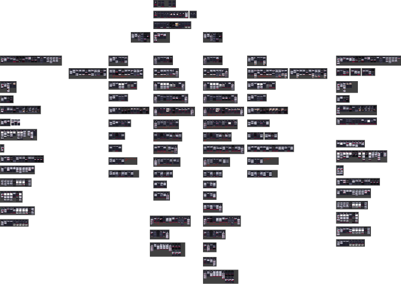

<div align="center">

# Bookers



</div>

### Loyihaning dizayni Figma orqali yaratilgan va quyidagi havola orqali ko'rishingiz mumkin: [Bookers Figma Dizayni](https://www.figma.com/design/h4qc56fFggOKSNipgKggfR/Bookers_first_ver_update-(Copy)?node-id=12-24383&t=BvmBpa8XT31XaDT6-0)


## Texnologiyalar

  - Pug (Template Engine)
  - SCSS (CSS Preprocessor)
  - HTML5
  - CSS3

## O'rnatish va Ishga Tushirish

Loyihani lokal muhitda ishga tushirish uchun quyidagi amallarni bajaring:

1. Repozitoriyani klonlash:
   ```sh
   git clone https://github.com/jasurhaydarovcode/bookers.git
   ```

## Devleopers ✅

## Table

| No  | Ism        | Page       |
| --- | ---------  | ---------- |
`REGISTRATION`
| 1   | Jo'rayev Sh. | Login | 
`Free Qolgan Bolimlar`
| 2   | E. SARDOR  | Kartochka --> Tarif  |
| 3   | Y. MIRJALOL| Istoriya --> Kartochka Zapisi  |
| 4   | S. ASILBEK | Zapisat Klient --> Nastroyki  |
`Free Edit & Delete`
| 5   | E. ASLIDDIN| Redaktravanie --> Nastroyki Mesta  |
| 6   | KHUJAMOV   | Redaktiravanie Galereya --> Redakt. Uvlomeniya  |
`Free Create`
| 7   | JAVLON     | Nastroyki Uslug --> Nastroyki Online |
| 8   | O'ktam     | Nastroit Online --> Oxirigacha  |
| 9   | Y. Behruz  | Nastroyki Klienta --> Oxirigacha  |
`Standart Create`
| 10   | R. Ulug'bek  | Nastroyki Uslug --> Nastroyk Online  |
| 11   | R. Avazbek  | Nastroyki Online --> Nastroyki Uvlomeniya  |
| 12   | Q. ASILBEK  | Nastroyki Uvlomeniya --> Oxirigacha  |
`Standart Edit & Delete`
| 13   | T. Bobur      | Redaktravanie --> Redaktravat Galereya  |
| 14   | Y. Dilshod  1 | Redaktravanie Online --> Oxirigacha  |
`Standart Qolgan Bo'limlar`
| 15   | S. Timur      | Kartochka Klient --> Rasxod  |
| 16   | Y. Dilshod 2  | Finans --> Kartochka Zapisi  |
| 17   | JASUR      | Kartochka Zapisi --> Oxirigacha  |

| Owner      | Server Page       |
| ---------  | ---------- |
| JASUR      | https://booker-two.netlify.app/booker-jasur/html/kartochka-zapisi/profile.html  |
